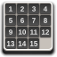

#  15-puzzle
[](http://www.gnu.org/licenses/gpl-3.0)

A classic 15-puzzle game


### Building and Installation

```bash
git clone https://gitlab.com/nvlgit/pyatnashkee.git && cd pyatnashkee
meson builddir --prefix=/usr && cd builddir
ninja
sudo ninja install
```
For rpmbuild: <a href="https://gitlab.com/nvlgit/fedora-specs/blob/master/pyatnashkee.spec">pyatnashkee.spec</a> 
